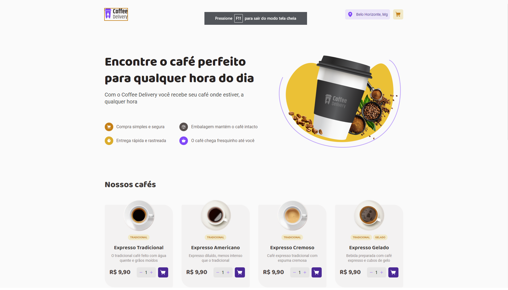
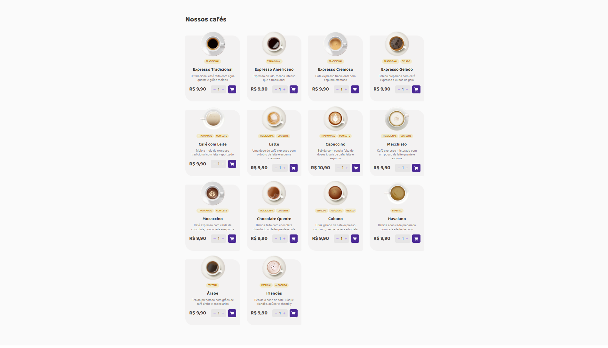
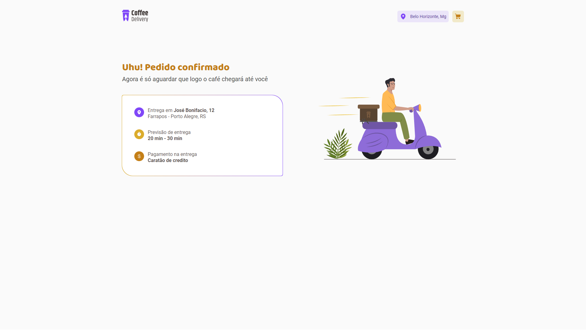

## CoffeeDelivery

This application is a challenge from the rocketSeat programming course. It has a website where coffee is sold.

Esta aplicação é um desafio do curso de programação rocketSeat. Onde a aplicação é um site onde se vende café.

We have a list of coffee which if selected will be added to a state.

Temos uma lista de cafés que, se selecionados, serão adicionados a um estado.

Before being added to the state, it is confirmed that the selected coffee does not exist, if it exists, its quantity will be assigned to its previous value, but if there is not, a new coffee will be created.

Antes de ser adicionado ao estado, confirma-se se o café selecionado não existe, se existir, sua quantidade será atribuída ao seu valor anterior, mas se não houver, um novo café será criado.

 

When the purchase is confirmed the user will be redirected to the success page.

Quando é confirmado a compra o usuario sera redirecionado para a pagina de sucesso.